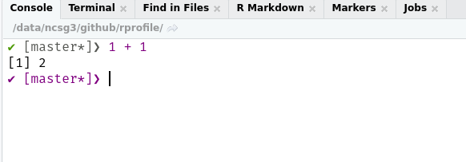
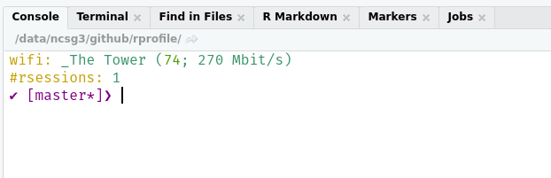
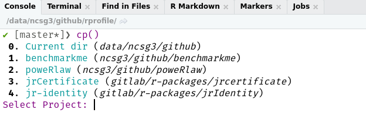

<!-- README.md is generated from README.Rmd. Please edit that file -->

```{r, include = FALSE}
knitr::opts_chunk$set(
  collapse = TRUE,
  comment = "#>",
  fig.path = "man/figures/README-",
  out.width = "100%"
)
```

# My opinionated .Rprofile

<!-- badges: start -->
[](https://CRAN.R-project.org/package=rprofile)
[](https://www.tidyverse.org/lifecycle/#experimental)
[](https://github.com/csgillespie/rprofile/actions)
<!-- badges: end -->

A package (of my) Rprofile customisations. The goal is it broaden the package
to be of use to other people.

## Installation

You can install the development version from [GitHub](https://github.com/) with:

``` r
# install.packages("remotes")
remotes::install_github("csgillespie/rprofile")
```

The package also uses two non-cran packages

``` r
# Used for nice prompts
remotes::install_github("gaborcsardi/prompt")

# Used for nice colours in the terminal
# Not for Windows
remotes::install_github("jalvesaq/colorout")
```

## R Prompt

The R prompt has also been customised (using the __prompt__ package):

 * If you are in a Git repo, the branch will be displayed.
 * If R's memory becomes large, the size will be displayed.

A distinction needs to be made between the RStudio Console and the terminal. The console
already has lots of nice features, e.g. syntax highlighting. So I have two
separated functions.



### Useful Start-up Messages

Currently three start-up messages are displayed:

 * The wifi network you are connected to with speed info
 * The number of open R sessions
 * RStudio Project info



### Helper Functions

It's always dangerous to load functions in your start-up script, so I've only included
functions I'm fairly sure won't be used in a script.

 * `create_make_functions()` - if you have a `Makefile` in your working directory, this will
 automatically generate all associated make functions. For example, if you have a `force` argument in the `Makefile` this will generate `make_force()`

 * `lsos()` - a handy function for listing large objects

 * `library()` - Over writes the `library()` function with a smarter version. If a package
 is missing, automatically provides the option to install from CRAN or GitHub

 * `last_error()` and `last_trace()` - pre-loads from __rlang__. Nicer error investigation

### RStudio functions

 * `op(path = ".")` - Creates & opens an RStudio project in the the directory specified

 * `cp()` - Lists previous RStudio projects and gives an option to open.

 * `inf_mr()` - Shortcut to `xaringan::inf_mr()`.



### Setting Better `options()`

The `set_startup_options()` function sets better (in my opinion) set of start-up options.
These include

 * Setting `Ncpus` to run parallel installs by default
 * Removing significant stars
 * Reduce the default print length
 * Plus a few others

I've also created a convenience function for adding additional R repositories - `set_repos()`.
Probably not needed by most people.

## Example `.Rprofile`

Open your `.Rprofile`, e.g. `file.edit("~/.Rprofile")` and customise however you want.
Here's an example

```

# Set options for Rscript -e calls
if (requireNamespace("rprofile", quietly = TRUE)) {
  # Call here if needed
  # rprofile::set_repos()
  rprofile::set_startup_options()
}

if (interactive() && requireNamespace("rprofile", quietly = TRUE)) {
  rprofile::create_make_functions()
  # Not RStudio OR RStudio console
  if (rprofile::is_terminal()) {
    rprofile::set_terminal()
  } else {
    rprofile::set_rstudio()
  }
  .env = rprofile::set_functions()
  attach(.env)
  # Display wifi and no of R sessions
  # Linux only
  rprofile::set_startup_info()
}

# Prints RStudio project on start-up
setHook("rstudio.sessionInit", function(newSession) {
  active_rproj = rprofile::get_active_rproj()
  if (!is.null(active_rproj)) {
    message(glue::glue("{crayon::yellow('R-project:')} {active_rproj}"))
  }
}, action = "append")
```

## Notes

 * The `lsos()` function was taken from the [SO](https://stackoverflow.com/q/1358003/203420)
 question.

 * The improved version of `library()` was adapted from the
 [autoinst](https://github.com/jimhester/autoinst/). I did think about importing the package,
 but I had made too many personal tweaks.

 * Setting the prompt uses the excellent [prompt](https://github.com/gaborcsardi/prompt)
 package.

 * I've probably "borrowed" some of the other ideas from blogposts and SO questions. If I've missed crediting you, please let me know and I'll rectify it.

Other information
-----------------

 * If you have any suggestions or find bugs, please use the github [issue tracker](https://github.com/csgillespie/rprofile/issues)
 * Feel free to submit pull requests
